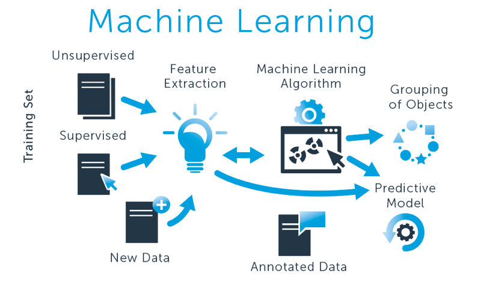

---
Here, we learned Machine learning which is the science of getting computers to act without being explicitly programmed.

**[Data Preprocessing:](https://github.com/cliferraren/Machine-Learning/tree/master/Data%20PreProcessing)**

 1. [Data Preprocessing - Brain Categorical](https://github.com/cliferraren/Machine-Learning/blob/master/Data%20PreProcessing/Data%20Preprocessing.ipynb)
 2. [Data Preprocessing - Respiratory Disease](https://github.com/cliferraren/Machine-Learning/blob/master/Data%20PreProcessing/Respiratory%20Disease.ipynb)
---

**[Supervised Learning:](https://github.com/cliferraren/Machine-Learning/tree/master/Supervised)**

* [Regression:](https://github.com/cliferraren/Machine-Learning/tree/master/Supervised/Linear%20Regression)
    > Linear Regression is a fundamental algorithm in machine learning
    > It is used as a building block for other ML models.
    > LR is fast and easy to understand, calculate, and interpret.
    > Often good enough. Don't over-engineer your solution. If your data is linear then use a linear model.
 1. [Univariate Linear Regression - Intro](https://github.com/cliferraren/Machine-Learning/blob/master/Supervised/Linear%20Regression/Univariate_Linear_Regression.ipynb)
 2. [Linear Regression - LSD DATA](https://github.com/cliferraren/Machine-Learning/blob/master/Supervised/Linear%20Regression/LinearRegression_LSD_DATA.ipynb)
 3. [Quantifying Regression - Intro](https://github.com/cliferraren/Machine-Learning/blob/master/Supervised/Linear%20Regression/Quantifying_Regression.ipynb)
 4. [Quantifying Regression - Brain Data](https://github.com/cliferraren/Machine-Learning/blob/master/Supervised/Linear%20Regression/Quantifying%20Linear%20Regression_Brain.ipynb)
 5. [Multi Linear Regression - Intro](https://github.com/cliferraren/Machine-Learning/blob/master/Supervised/Linear%20Regression/MultiVariate%20Linear%20Regression.ipynb)
 6. [Multi Linear Regression - Beer Foam Data](https://github.com/cliferraren/Machine-Learning/blob/master/Supervised/Linear%20Regression/MultiLinear%20Regression%20-%20Beer.ipynb)
 7. [Linear Regression - Life Satisfaction](https://github.com/cliferraren/Machine-Learning/blob/master/Supervised/Linear%20Regression/LifeSatisfaction_vs_Income.ipynb)

* [Classification:](https://github.com/cliferraren/Machine-Learning/tree/master/Supervised/Logistic%20Regression)
    > Logistic regression is the appropriate regression analysis to conduct when the dependent variable is dichotomous (binary). Like all regression analyses, the logistic regression is a predictive analysis.

1. [Logistic Regression - Intro](https://github.com/cliferraren/Machine-Learning/blob/master/Supervised/Logistic%20Regression/Logistic%20Regression%20-Intro.ipynb)
2. [Logistic Regression - Voice Gender Recognition](https://github.com/cliferraren/Machine-Learning/blob/master/Supervised/Logistic%20Regression/Voice%20Recognition.ipynb)

---

* [Decision Trees & Random Forests](https://github.com/cliferraren/Machine-Learning/tree/master/Supervised/Decision%20Trees%20%26%20Random%20Forests)

1. [Decision Trees](https://github.com/cliferraren/Machine-Learning/blob/master/Supervised/Decision%20Trees%20%26%20Random%20Forests/Decision%20Trees.ipynb)
    > These True/False questions can be represented with a series of If/Else Statements
    > Decision Trees can become very complex and may not generalize well
2. [Diabetes Data using Decision Trees Classifier](https://github.com/cliferraren/Machine-Learning/blob/master/Supervised/Decision%20Trees%20%26%20Random%20Forests/DecisionTree%20Classifier-%20Diabetes%20Data.ipynb)

3. [Random Forests](https://github.com/cliferraren/Machine-Learning/blob/master/Supervised/Decision%20Trees%20%26%20Random%20Forests/Random%20Forests.ipynb)
    > Instead of a single, complex tree like in the previous slide, a random forest algorithm will sample the data and build many smaller, simpler decisions trees (i.e. A forest of trees).
    > Each of these trees are much simpler because they are built from a subset of the data. 
    > Each simple tree is considered a “weak classifier”, but when you combine them, they form a “strong classifier”